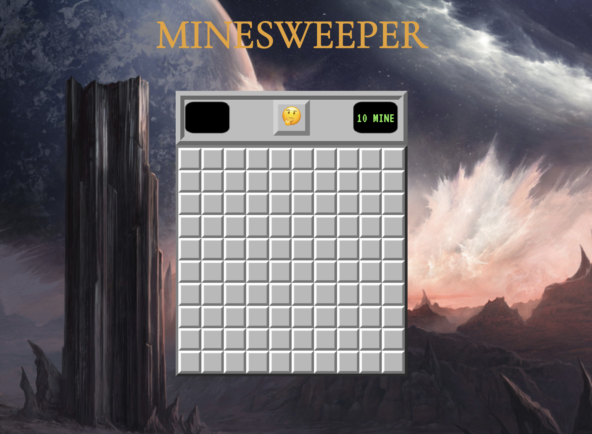
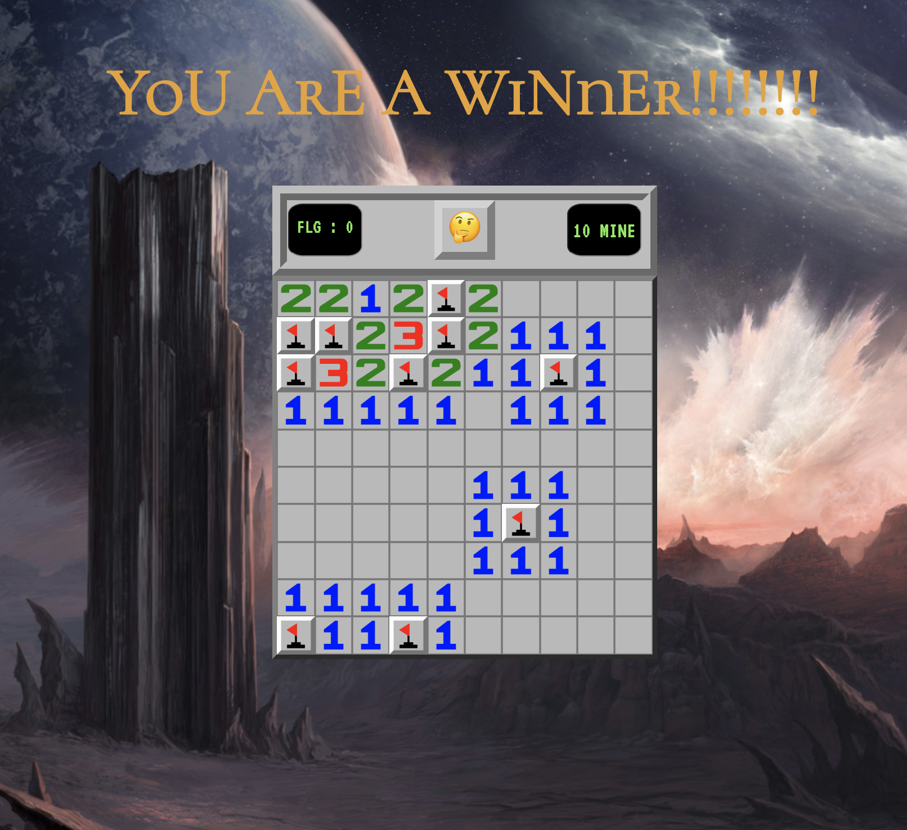
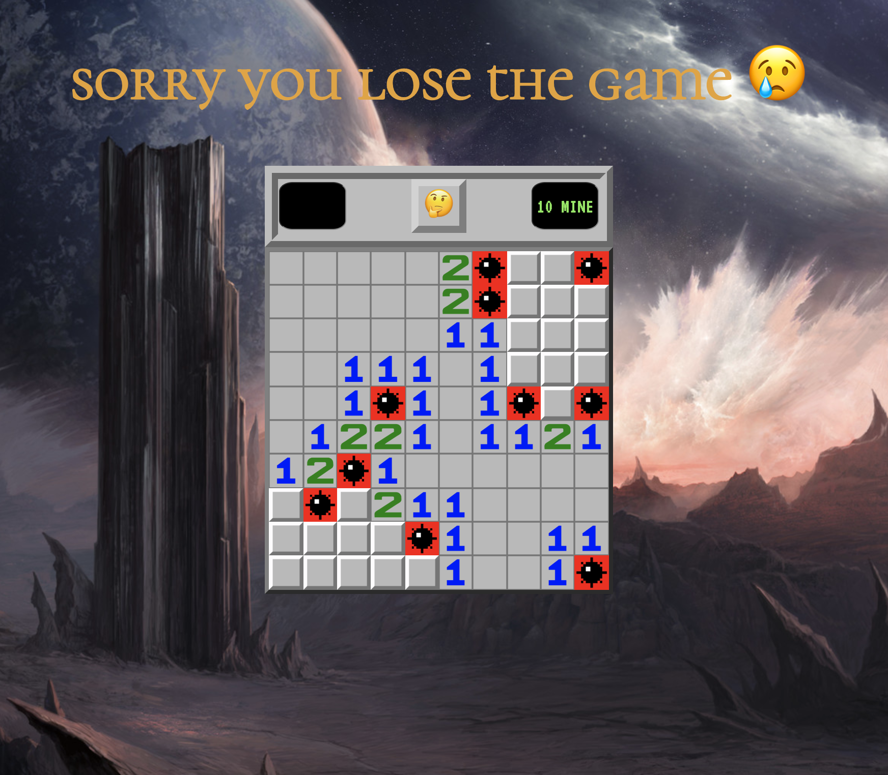
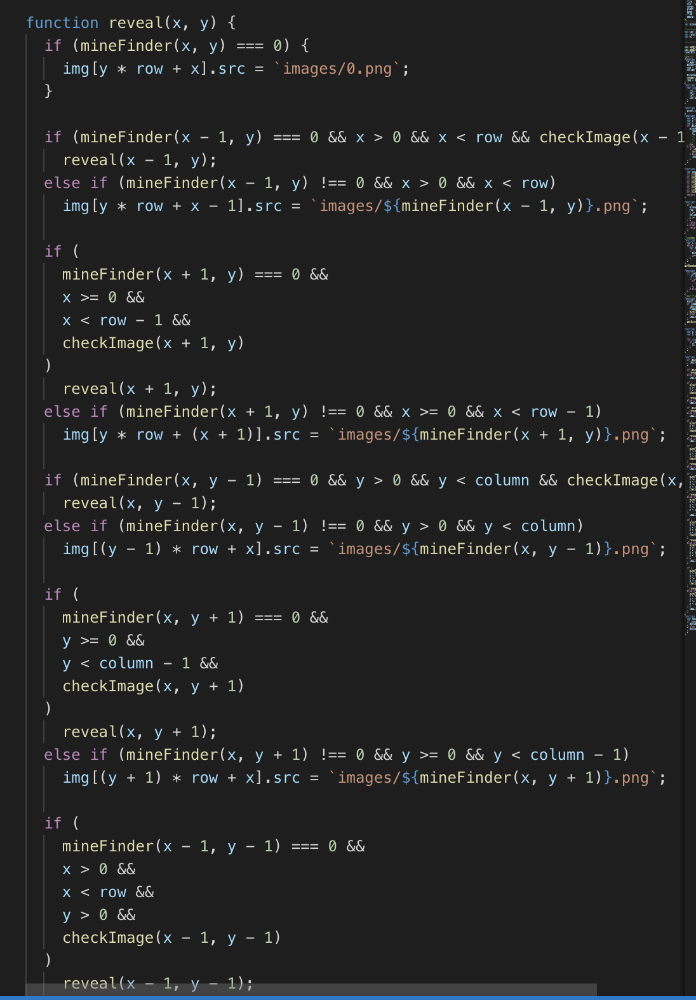

# Minesweeper-game
______________

## Technologies Used

I used JavaScript, HTML, CSS

## Getting Started

[Let's start the game](https://payam12444.github.io/Minesweeper-game/)

The game is about finding the hidden mines. Each box you click on will either show a number of mines around each box or a mine. If there is no number it means that there is no mine around it. You can put a flag by right-clicking anywhere you think there is a mine. If you click all the boxes without clicking a mine, you will win.

In the blow section i used recursion to expand the boxes if there is no mine:

## Unsolved Problems

My plan for the future is add choose for easy,medium,hard game.